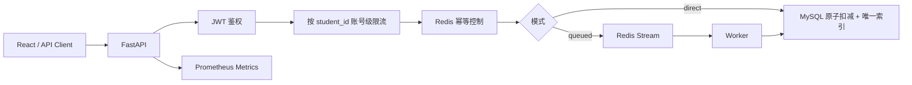

# 基于 Token 身份认证与 Redis 的高校选课高并发访问治理系统

一个面向课程设计、实验教学和高并发治理研究的完整演示项目。项目使用**自带模拟选课系统**复现“同一账号、多设备、共享 Token、同时请求”的高并发场景，并通过账号级限流、幂等控制、数据库事务、Redis Stream 排队和监控指标进行治理。

> 安全边界：本仓库的压测脚本内置本地目标限制，仅用于 `localhost / 127.0.0.1 / backend` 等项目自有实验环境，不用于真实高校系统或其他未授权服务。

## 技术栈

- 前端：React + TypeScript + Vite
- API：FastAPI
- 身份认证：JWT Bearer Token
- 数据库：MySQL 8 + SQLAlchemy Async
- Redis：账号级滑动窗口限流、幂等键、设备会话、Redis Stream 队列
- 异步消费：独立 Worker
- 压测：Locust
- 监控：Prometheus + Grafana
- 部署：Docker Compose

## 核心治理链路



## 项目结构

```text
campus-course-governance/
├─ backend/                 FastAPI + Worker
├─ frontend/                React 管理/演示页面
├─ loadtest/                Locust 多设备共享 Token 模拟
├─ monitoring/              Prometheus + Grafana
├─ scripts/                 本地辅助脚本
├─ docker-compose.yml
├─ .env.example
└─ README.md
```

## 一键启动

### 1. 准备环境变量

```bash
cp .env.example .env
```

### 2. 启动全部服务

```bash
docker compose up --build
```

服务地址：

- 前端：http://localhost:5173
- API 文档：http://localhost:8000/docs
- API 健康检查：http://localhost:8000/health
- Prometheus：http://localhost:9090
- Grafana：http://localhost:3001（admin / admin）

## 演示账号

系统首次启动会自动创建：

| 用户名 | 密码 | 角色 |
|---|---|---|
| `student1` | `demo123` | 学生 |
| `student2` | `demo123` | 学生 |
| `student3` | `demo123` | 学生 |
| `admin` | `admin123` | 管理员 |

并创建若干模拟课程。

## 关键 API

### 登录

```http
POST /auth/login
Content-Type: application/json

{"username":"student1","password":"demo123"}
```

返回 JWT：

```json
{
  "access_token": "...",
  "token_type": "bearer"
}
```

### 获取课程

```http
GET /courses
Authorization: Bearer <TOKEN>
X-Device-Id: laptop-a
```

### 直接选课

```http
POST /courses/1/select?mode=direct
Authorization: Bearer <TOKEN>
X-Device-Id: laptop-a
```

### 排队选课

```http
POST /courses/1/select?mode=queued
Authorization: Bearer <TOKEN>
X-Device-Id: phone-b
```

返回 `job_id`，随后轮询：

```http
GET /jobs/{job_id}
```

### 查看自己的已选课程

```http
GET /enrollments/me
```

### 管理员查看某学生活跃设备

```http
GET /admin/users/{user_id}/devices
```

## 高并发实验

### 多设备共享同一个 Token

仓库中的 Locust 会让所有虚拟设备共享 `student1` 的同一个 JWT，每个虚拟设备只使用不同的 `X-Device-Id` 发起请求，用于验证：

1. 多设备是否会放大请求频率；
2. 账号级限流是否优于设备级限流；
3. 幂等键是否可以压制同一学生对同一课程的重复请求；
4. 数据库唯一索引是否可以作为最终一致性兜底；
5. Redis Stream 是否能降低数据库瞬时压力。

### 运行压测

```bash
docker compose --profile loadtest run --rm locust \
  -f /mnt/locust/locustfile.py \
  --headless -u 200 -r 20 -t 60s
```

Locust 脚本会拒绝向非本项目本地目标发压测流量。

## 治理策略

### 账号级滑动窗口限流

Redis ZSET + Lua 脚本按 `student_id` 统计窗口内请求数量：

```text
rate:user:{student_id}
```

默认限制：10 秒最多 5 次选课请求，可在 `.env` 调整。

### 幂等控制

同一学生对同一课程短时间内只允许一个有效请求：

```text
idem:select:{student_id}:{course_id}
```

使用 `SET key value NX EX ttl`。

### 数据库一致性

- `UNIQUE(student_id, course_id)` 防止重复选课；
- `UPDATE ... WHERE remaining > 0` 原子扣减容量；
- 事务失败时自动回滚，避免“扣了名额但没生成选课记录”。

### 排队削峰

排队模式不直接打 MySQL：

```text
API -> Redis Stream -> Worker -> MySQL
```

前端收到 `job_id` 后查询任务状态。

## Prometheus 指标

项目暴露：

- `course_http_requests_total`
- `course_http_request_duration_seconds`
- `course_selection_results_total`

Grafana 已预置基础 Dashboard。

## 开发测试

后端语法检查：

```bash
python -m compileall backend/app
```

测试：

```bash
cd backend
pytest -q
```

## 可继续扩展

- Redis Lua Token Bucket / Leaky Bucket
- 抽签式公平排队
- WebSocket 实时排队位置
- OpenTelemetry 链路追踪
- Nginx 层限流与熔断
- Redis Cluster / MySQL 主从
- 多副本 FastAPI + Kubernetes
- 对比“无治理 / 限流 / 限流+队列”三组实验数据

## License

MIT
